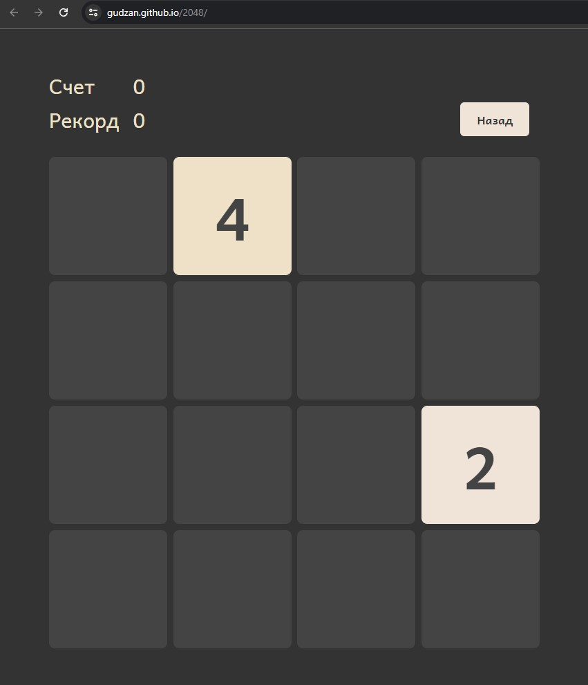
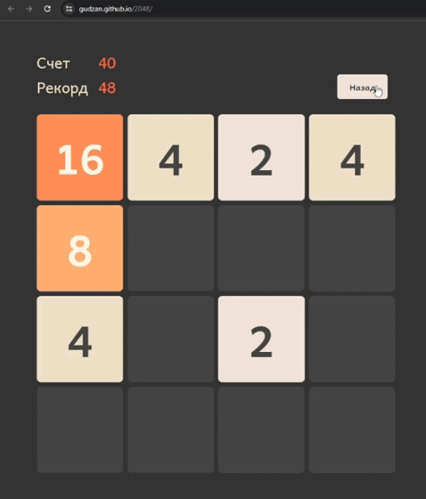
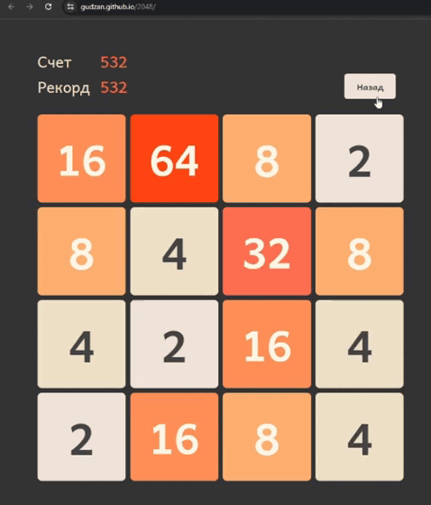
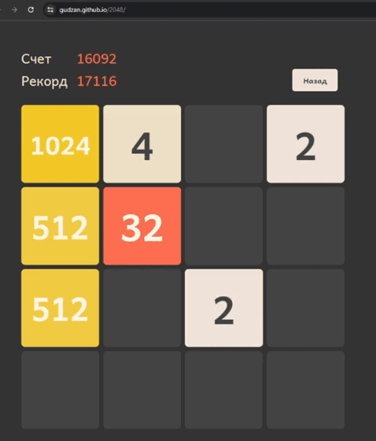

# 2048

## О игре

2048 - это игра-головоломка для одного игрока, в которой нужно сдвигать плитки, объединяя их. Когда две плитки с одинаковым числом соприкасаются, они сливаются в одну, а числа складываются. Нужно перемещать плитки, пока не достигнуто число 2048(при желании можно продолжить дальше). Если полностью заполнить поле, не достигнув числа 2048, игра заканчивается.

[Официальный сайт игры](https://play2048.co/)

## О проекте

Это мой самый первый pet проект на JavaScript, созданный исключительно для отработки знаний языка.

## Установка

Чтобы развернуть проект у себя локально достаточно просто скопировать репозиторий к себе на компьютер, перейти в папку проекта и открыть index.html

```
git clone https://github.com/gudzan/2048.git
cd 2048
index.html
```

## Демо

Поиграть и протестировать проект без скачивания можно по ссылке - https://gudzan.github.io/2048/

## Реализация

Проект разработан с использованием html, css, js.
Из сторонних библиотек использована библиотека [swiped](https://github.com/john-doherty/swiped-events), для отлавливания свайпов на сенсорных устройствах.

Основные механики:

- Начало игры. Игра всегда начинается с одной/двух случайно расположенных клетки на поле
<p align="center">

</p>

- Движение плиток и слияние. Управление происходит с помощью клавиш стрелочек на клавиатуре или с помощью свайпов на сенсорных устройствах. При каждом движении в случайном месте появляется плитка с номером 2 или 4
<p align="center">

</p>

-   Для хранения счета и рекорда используется local storage

-   Возврат к предыдущему значению. Как в оригинальной игре, вернуться можно только на один шаг назад
<p align="center">

</p>

-   Проигрыш игры. В ситуации, когда движение невозможно ни в одну из сторон, игра считается проигранной и игрок может начать игру заново
<p align="center">

</p>
  
-   Победа. В ситуации, когда на поле появляется плитка со значением 2048, объявляется победа. Игрок может продолжить игру и набирать очки дальше или начать игру заново.
<p align="center">

</p>